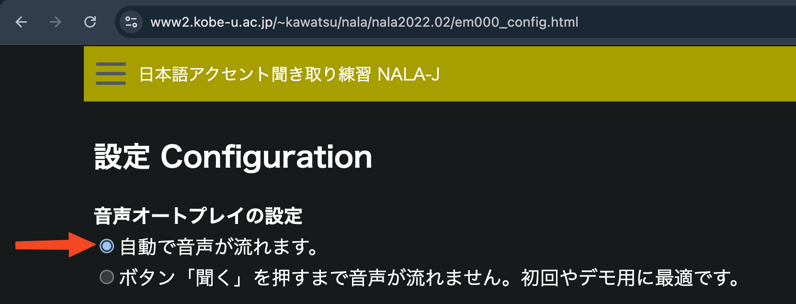

# NALA-J

Stands for "Nihongo Accent Learning Aid - Japanese". It's an ancient website with horrible UI. But now it's actually usable if spend a couple of minutes setting it up.

## After vs Before

...
...

## My Improvements

- Better UI.

- Hotkey: spacebar -> play audio (聞く).

- Auto-click "Start" (はじめる).

- Block beforeunload popups.

## How to Upgrade Nala-J

1. Go [here](https://www2.kobe-u.ac.jp/~kawatsu/nala/nala2022.02/em000_config.html)
   and select "自動で音声が流れます".

2. Install [Stylus](https://chromewebstore.google.com/detail/stylus/clngdbkpkpeebahjckkjfobafhncgmne?hl=en)
   and add [this style](style.css).

3. Install [Tampermonkey](https://chromewebstore.google.com/detail/tampermonkey/dhdgffkkebhmkfjojejmpbldmpobfkfo?hl=en)
   (or any alternative) and add [this userscript](userscript.js).

4. You are ready to learn pitch [here](https://www2.kobe-u.ac.jp/~kawatsu/nala/nala2022.02/15_2haku_hint.html).
